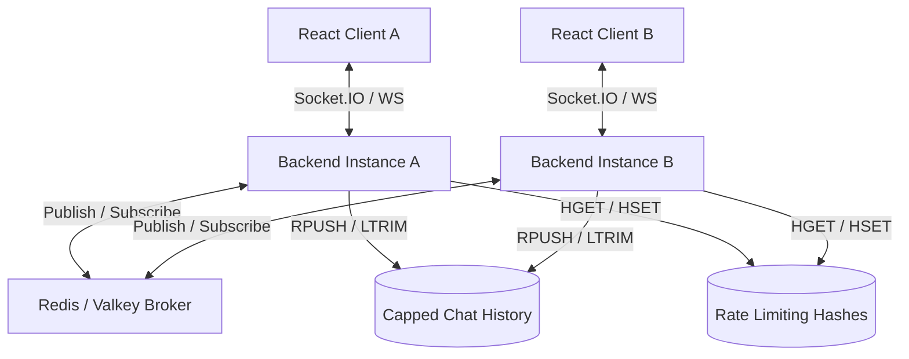

# Real-time Chat Application

A high-performance, horizontally scalable real-time chat application built with a Node.js/Express/TypeScript backend and a modern React 19/Vite/Tailwind CSS frontend. The application leverages Socket.IO for real-time messaging, and Redis/Valkey for pub/sub event broadcasting, history caching, and rate limiting.

---

## 🗺️ Project Architecture

The repository is structured as a monorepo containing:
*   **Backend Server (`/`)**: Express API and Socket.IO server powered by TypeScript and Node.js.
*   **Frontend Client (`/chat-app-frontend`)**: React 19 SPA configured with Vite, TypeScript, and Tailwind CSS v4.



---

## ⚙️ Key Technical Features

### 1. Horizontal Scaling & Server Clustering (Redis Pub/Sub)
Since WebSockets are persistent and stateful, a client connected to **Server A** cannot directly send messages to a client connected to **Server B**. 
To resolve this and support horizontal scaling, we implemented a Pub/Sub coordination layer using Redis/Valkey:
*   **Two Redis Connections**: We instantiate separate Redis clients to avoid blocking:
    *   `publisher`: Handles general read/write queries and publishes outgoing chat events.
    *   `subscriber`: Dedicated strictly to listening to the `"chat"` channel events.
*   **Message Delivery Flow**: When Client A emits a message to Server A, Server A writes it to Redis and publishes the event. Redis broadcasts this to all connected server instances (Server A, Server B, etc.), which in turn relay the message to their local WebSocket clients.

### 2. Capped Message History (Redis Lists)
Instead of relying on volatile local memory caches, messages are stored in Redis:
*   **Append (`RPUSH`)**: New messages are appended to the right tail of the list `chat_history`.
*   **Eviction (`LTRIM`)**: To prevent infinite memory growth, `LTRIM chat_history -100 -1` is executed after every push, keeping only the 100 most recent messages.
*   **Initial Sync (`LRANGE`)**: On mounting, the React client queries the `/load-messages` endpoint, which retrieves the entire capped history chronologically using `LRANGE chat_history 0 -1`.

### 3. Distributed Rate Limiting (Redis Hash Map)
To protect server resources and block message flooding consistently across all nodes, we implemented a custom Redis-backed rate limiter:
*   **Rules**: Users are limited to **3 messages every 10 seconds**.
*   **State (`ratelimit:${socket.id}`)**: Stores the message count and current window start timestamp.
*   **Evaluation**: If the window is active and `count >= 3`, messages are blocked, and a system alert is sent back to the client. Otherwise, the count increments (`HINCRBY`) or resets if the window has expired.
*   **Active Cleanup**: When a socket disconnects, the rate limiter state is immediately deleted (`DEL`) from Redis to prevent orphaned memory.

### 4. Client Resiliency & UX Polish
*   **Session Persistence**: The React frontend generates a unique `userId` stored in `localStorage`. This persistent ID is sent with message payloads to align sender bubbles to the right and receiver bubbles to the left, surviving page refreshes or reconnects.
*   **Connection States**: Includes a connection status badge ("active" with green pulse or "reconnecting..." with amber pulse) driven by Socket.IO's native `connect` and `disconnect` event listeners.
*   **Render Cold-Start Protection**: Built-in loading screen with an animated spinner that explains server wake-up times (which can take up to 60 seconds on Render's free tiers).
*   **Cron-Friendly Keep-Alive**: Includes a `/ping` Express endpoint to support external uptime checkers (e.g., cron jobs) to prevent the backend container from sleeping.

---

## 🛠️ Tech Stack

### Backend
*   **Runtime**: Node.js (ES Modules)
*   **Language**: TypeScript
*   **Server**: Express
*   **Real-time Engine**: Socket.IO (Server)
*   **Database/Broker**: Valkey / Redis (using `ioredis`)

### Frontend
*   **Framework**: React 19 (Vite SPA)
*   **Language**: TypeScript
*   **Styling**: Tailwind CSS v4 (using `@tailwindcss/vite` plugin)
*   **Client**: Socket.IO-client

---

## 🚀 Running Locally

### 1. Run Valkey / Redis
Make sure you have Docker running, then start Valkey:
```bash
docker compose up -d
```

### 2. Run the Backend Server
From the root directory, create a `.env` file:
```env
PORT=3000
REDIS_URL=redis://localhost:6379
FRONTEND_URL=http://localhost:5173
```
Install dependencies and run the server:
```bash
pnpm install
pnpm run dev
```

### 3. Run the React Frontend
Navigate to the frontend directory:
```bash
cd chat-app-frontend
```
No environment variables are strictly required locally as the client defaults to `http://localhost:3000`. To customize, set `VITE_BACKEND_URL`.
Install dependencies and run the development server:
```bash
pnpm install
pnpm run dev
```
